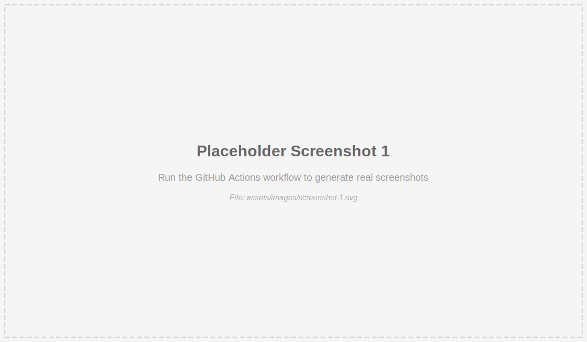

# LoadBalanceViz

A visual simulator for load balancing algorithms.

## How to Run
1.  Navigate to the project folder: `C:\Users\vemur\.gemini\antigravity\scratch\load_balancer_viz`
2.  Double-click `index.html` to open it in your web browser.

## Screenshots

Here are some visual previews of the LoadBalanceViz application:

### Screenshot 1

*Initial view of the load balancer visualization*

### Screenshot 2

*Load balancer in action with different algorithm*

### Screenshot 3

*Server management and controls*

**Note:** These are placeholder images. To generate real screenshots:
- **Locally:** Install dependencies with `npm install`, then run `npm run generate:screenshots`
- **Via Workflow:** Trigger the "Generate Screenshots" workflow from the Actions tab in GitHub

## Features
-   **Algorithms**: Round Robin, Random, Least Connections.
-   **Controls**: Add/Remove servers, adjust simulation speed.
-   **Visuals**: Real-time request particles and server load indicators.
